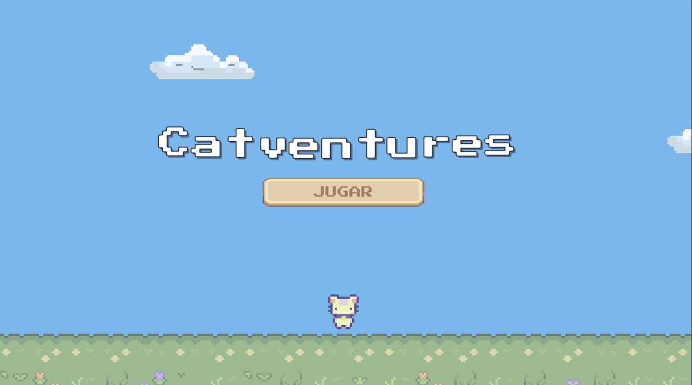
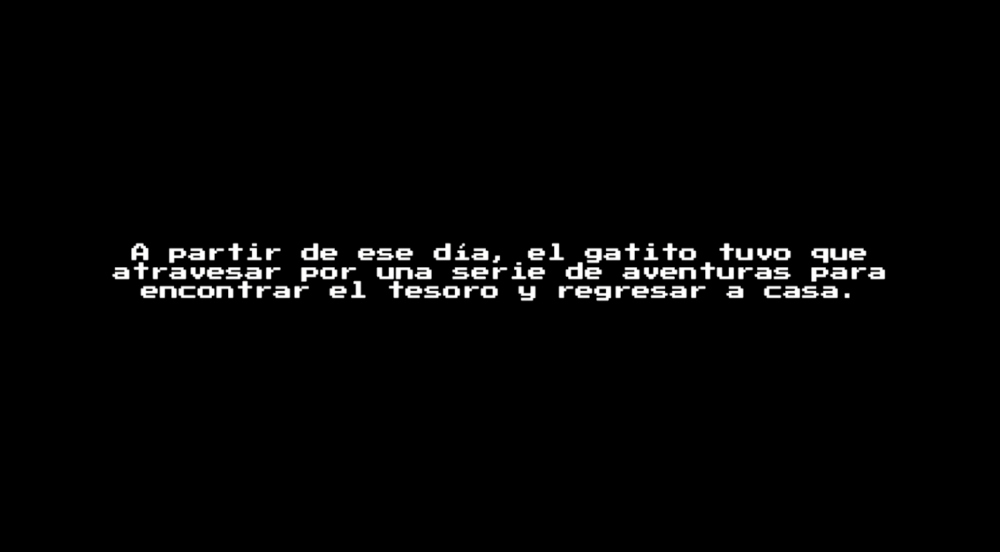
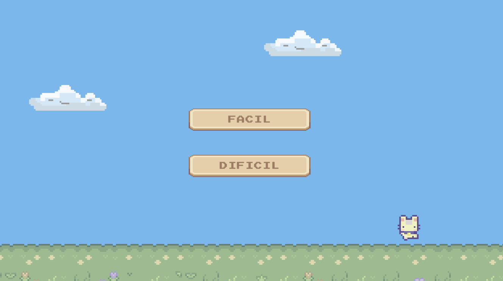
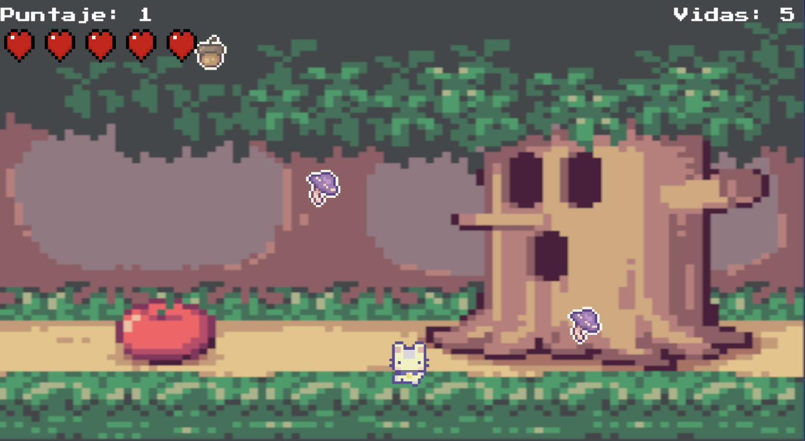

# 🐱 Catventures

> Un gatito perdió el camino a casa. A partir de ese día tuvo que atravesar
> una serie de aventuras para encontrar el tesoro y regresar.

Juego 2D en Unity desarrollado para la materia de **Lenguajes de Programación**.
Dos minijuegos encadenados con un mismo gatito, las mismas vidas y una
dificultad que se elige una sola vez al empezar.

**Materia:** Lenguajes de Programación · **Periodo:** 2026-1 · **Unity:** 6.5 (6000.5.3f1) · **Estado:** en progreso

### Equipo

| | |
|---|---|
| [Paula Martillo](https://github.com/paumquintana) | Menú, narración, laberinto TopDown |
| [Daniel Vaca](https://github.com/DanielV-13) | Minijuego Catcher, HUD, pantallas de final |

---

## Capturas

| | |
|:---:|:---:|
|  |  |
| **Menú principal** — el título se monta letra a letra y los botones entran después | **Narración** — máquina de escribir con sonido de tecla |
|  |  |
| **Dificultad** — se elige una vez y viaja a los dos minijuegos | **Catcher** — atrapa lo bueno, esquiva lo malo |

---

## Cómo jugar

El juego arranca con la narración, pasa al menú, y de ahí a los dos minijuegos
en orden. **Las vidas son las mismas para toda la aventura**: lo que pierdas en
el laberinto no lo recuperas en el Catcher.

### 🌿 Laberinto (TopDown)

Junta todas las monedas del laberinto mientras esquivas a los enemigos que van
apareciendo.

| Acción | Tecla |
|---|---|
| Moverse (8 direcciones) | `W` `A` `S` `D` o flechas |

- **Monedas** → suman puntaje. Hay que juntarlas **todas** para ganar. Se
  reparten en posiciones libres al azar, nunca dentro de un muro ni pegadas al
  gatito.
- **Enemigos** → te quitan una vida al tocarte. Deambulan al azar, pero si te
  ven a menos de cierta distancia y no hay pared en medio te persiguen; cuando
  te pierden, vuelven a deambular.
- Al recibir daño hay unos segundos de **invulnerabilidad con parpadeo**, para
  que dos enemigos juntos no te maten en cadena.

### 🍎 Catcher

Muévete de lado a lado y atrapa lo que cae del cielo.

| Acción | Tecla |
|---|---|
| Moverse | `A` `D` o flechas ← → |

- **Objetos buenos** → suman puntaje y acercan a la meta.
- **Objetos malos** → quitan una vida.
- Ganas al atrapar la cantidad de objetos buenos que marque la dificultad.

### Dificultad

Se elige **una sola vez**, en el menú, y aplica a toda la partida.

| | Fácil | Difícil |
|---|:---:|:---:|
| Vidas iniciales | 5 | 3 |
| Monedas para ganar el laberinto | 5 | 1 ⚠️ |
| Objetos buenos para ganar el Catcher | 10 | 15 |

⚠️ Los valores del laberinto están **invertidos**: en Difícil se gana con menos
monedas que en Fácil. Pendiente de corregir en `SpawnerMonedas → Meta De Monedas`.

---

## Arquitectura

El problema central del proyecto: **el jugador atraviesa cuatro escenas y sus
vidas, su puntaje y su dificultad tienen que sobrevivir a los cambios.** Unity
destruye todos los `GameObject` al cargar una escena nueva, así que un
`MonoBehaviour` normal perdería el dato.

### Estado compartido: clases `static`, no `MonoBehaviour`

`Partida` y `Dificultad` son clases estáticas. No viven en ninguna escena, así
que no hay nada que destruir.

```
Dificultad   → qué nivel eligió el jugador (además persiste en PlayerPrefs)
Partida      → vidas, puntaje y si la partida sigue en curso
```

Esto también resuelve un problema de organización: el panel de dificultad se
monta **una sola vez**, en la escena del menú. No hace falta convertirlo en
prefab ni copiarlo a cada minijuego. Lo que viaja entre escenas no es el panel,
es el dato.

### Comunicación por eventos

Nadie busca a nadie con `GameObject.Find()`. Los datos avisan y quien tenga
interés escucha:

```
Partida.AlCambiarVidas    →  HudCorazones repinta los corazones
Partida.AlCambiarPuntaje  →  HUDCatcher actualiza el marcador
Partida.AlPerder          →  GestorCatcher enciende el Game Over
Recolector.AlAtraparBueno →  GestorCatcher cuenta y decide la victoria
SpawnerMonedas.AlGanar    →  GestorTopDown lanza la pantalla de victoria
```

Gracias a esto el HUD de cada minijuego puede verse completamente distinto y
aun así los dos cuentan lo mismo. Cada quien hizo el suyo sin tocar el del otro.

> **Detalle de Unity 6:** el dominio de C# no se recarga al dar Play, así que
> los campos y eventos `static` conservan basura de la ejecución anterior. Por
> eso `Partida`, `Dificultad`, `Recolector` y `MenuPrincipal` limpian su estado
> en un método marcado con
> `[RuntimeInitializeOnLoadMethod(RuntimeInitializeLoadType.SubsystemRegistration)]`,
> que corre antes de que cargue ninguna escena.

### El escenario del laberinto

El mapa está pintado a mano sobre dos Tilemaps (suelo y paredes). El de paredes
lleva un `Tilemap Collider 2D`, y eso es lo único que impide que el gatito las
atraviese. Los límites del área los define `AreaJugable`, que además usan la
cámara para no encuadrar el vacío de afuera y los spawners para no colocar nada
dentro de un muro.

> Existe un `GeneradorLaberinto.cs` que genera laberintos en runtime con un
> *recursive backtracker*, pero **no está conectado a ninguna escena**. Quedó
> como trabajo exploratorio.

### Escenas

```
HistoriaInicio  →  narración + menú + selección de dificultad
JuegoTopDown    →  el laberinto
JuegoCatcher    →  el recolector
Final           →  cierre de la aventura
```

---

## Estructura del proyecto

```
Assets/
  Scripts/
    Comun/      ← lo que usan los dos minijuegos (editar de a uno y avisar)
    TopDown/    ← solo del laberinto
    Catcher/    ← solo del recolector
  Prefabs/      ← separados por minijuego, con Prefab Variants
  Sprites/      ← una sola copia de cada sprite, sin separar por minijuego
  Audio/
  Scenes/
```

El criterio no es "por tema", es **por quién lo edita**. Los scripts y prefabs
se separan porque es donde dos personas chocan; los sprites no, porque un PNG
se importa una vez y duplicarlo lleva a dos GUIDs que se desincronizan.

Las reglas completas de trabajo en equipo están en **[CONVENCIONES.md](CONVENCIONES.md)**.

---

## Cómo abrirlo

1. Instalar **Unity 6.5 (6000.5.3f1)**.
2. Clonar el repositorio:
   ```bash
   git clone https://github.com/bypaupau/JuegoGrupal-ProyectoIIParcial.git
   ```
3. Abrir la carpeta desde Unity Hub.
4. Abrir `Assets/Scenes/HistoriaInicio.unity` y darle Play.

> Para iterar sobre el menú sin ver la narración completa cada vez:
> `GestorMenu → Menu Principal → Saltar Narracion ✓`.

---

## Demo

*(pendiente: video de 1-2 minutos)*
